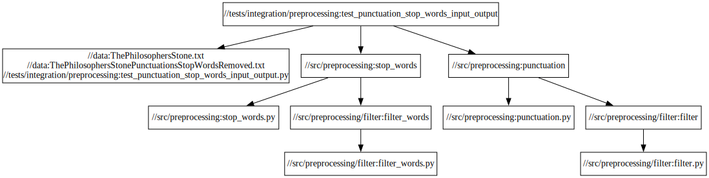
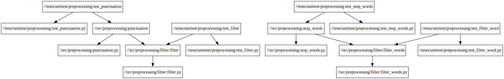

# Test Cache Demo


## Run all tests

```posix-terminal
bazel test //...
```

## Run unittests

```posix-terminal
bazel test //tests/unittest/...
```

## Run integration tests

```posix-terminal
bazel test //tests/integration/...
```

## Dependency graphs

In order to create dependency graphs with bazel you should install graphviz. 

### Single integration test



Dependency graph of test_punctuation_stop_words_input_output test

```posix-terminal
bazel query "deps(//tests/integration/preprocessing:test_punctuation_stop_words_input_output)" --notool_deps --noimplicit_deps --output graph | dot -Tsvg > /tmp/deps.svg
```

### All unittests



Dependency graph of all unittests

```posix-terminal
bazel query "deps(//tests/unittest/...)" --notool_deps --noimplicit_deps --output graph | dot -Tsvg > /tmp/deps.svg
```
